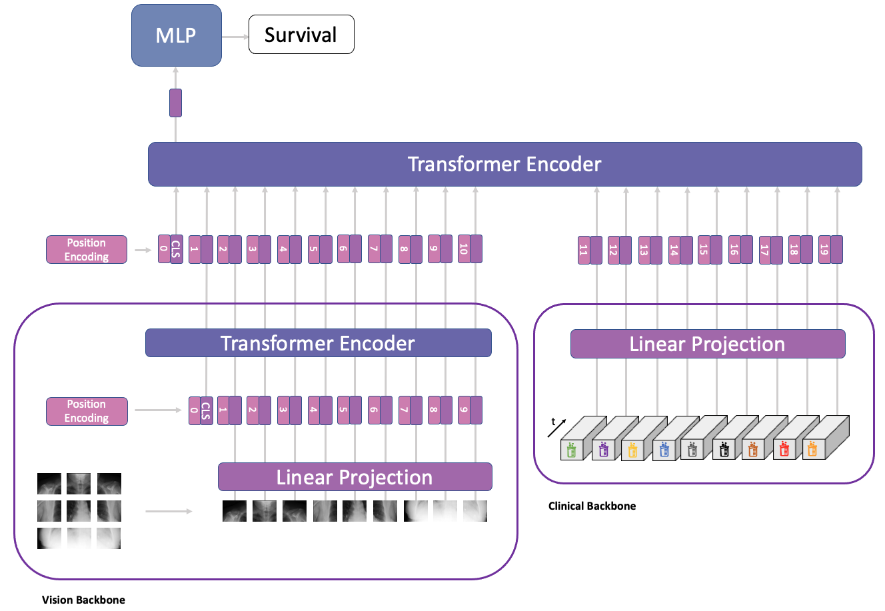

MeTra (Medical Transformer)
=========================

This repository contains the code to our corresponding publication "Medical Transformer for Multimodal Survival Prediction in Intensive Care through Chest Radiographs and Clinical Data".




## Setup

In order to run this model, please download MIMIC-CXR-JPG and MIMIC-IV (version 1.0) datasets and follow the steps detailed in utils/mimic4extract to create the dataset splits.

Additionally, create a virtual environment (e.g. with conda):
````
conda create -n metra python=3.8
````

and run 
```
conda activate metra
```
followed by
```
pip install -r requirements.txt
```
to download and install the required dependencies.

Note that we log our training results on Weights and Biases. (evtl. noch anpassen?)


## Training

Once everything is set up, run the follow commands to train the model.

To train the EHR model, run:
```
python classification/training/trainer.py dataset=mimic_lab meta.transforms=True optimizer.lr=5e-6 model.output_logits=1 model=multi_modal_pretrained_vit_lab meta.prefix_name=EHR scheduler=cosine_annealing epochs=200 meta.batch_size=50 meta.cross_validation=False meta.num_workers=20 model.transforms.img_size=384 meta.gpus=[0] meta.imbalance_handler=None optimizer.name=AdamW optimizer.lr_scheduler=None model.meta.p_visual_dropout=1.0 model.meta.p_feature_dropout=0.0

```

To train the CXR model, run:
```
python classification/training/trainer.py dataset=mimic_lab meta.transforms=True optimizer.lr=5e-6 model.output_logits=1 model=multi_modal_pretrained_vit_lab meta.prefix_name=CXR scheduler=cosine_annealing epochs=200 meta.batch_size=50 meta.cross_validation=False meta.num_workers=20 model.transforms.img_size=384 meta.gpus=[2] meta.imbalance_handler=None optimizer.name=AdamW optimizer.lr_scheduler=None model.meta.p_visual_dropout=.0 model.meta.p_feature_dropout=1.0
```

To train the EHR+CXR model, run:
```
classification/training/trainer.py dataset=mimic_lab meta.transforms=True optimizer.lr=5e-6 model.output_logits=1 model=multi_modal_pretrained_vit_lab meta.prefix_name=EHR+CXR scheduler=cosine_annealing epochs=200 meta.batch_size=50 meta.cross_validation=False meta.num_workers=20 model.transforms.img_size=384 meta.gpus=[3] meta.imbalance_handler=None optimizer.name=AdamW optimizer.lr_scheduler=None model.meta.p_visual_dropout=.3 meta.checkpoint_path=[ABSOLUTE PATH TO BEST EHR CHECKPOINT]
```

## Evaluation

In order to evaluate the models, open the jupyter notebook located at classification/eval/evaluate.ipynb and follow the stops. Note that you will need to provide the paths to the trained models.


